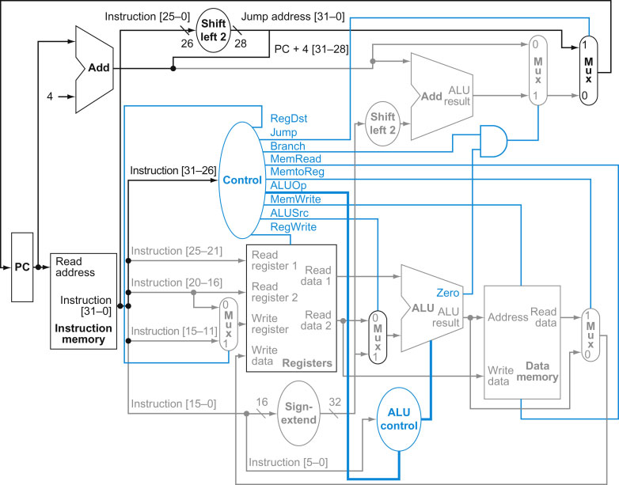
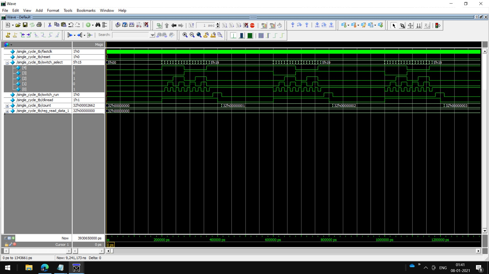

# Single-Cycle-Risc-Processor-32-bit-Verilog
Trying to implement a single cycle MIPS computer in Verilog that supports MIPS assembly instructions including:

- Memory-reference instructions load word <code>lw</code> and store word <code>sw</code>
- Arithmetic-logical instructions <code>add</code>, <code>addi</code>, <code>sub</code>, <code>and</code>, <code>andi</code>, <code>or</code>, and <code>slt</code>
- Jumping instructions branch-equal <code>beq</code> and jump <code>j</code>

Below image is the Risc processor I am trying to impleent, But end product may not be exactly the same. 
[img_src: Click Here ](https://www.eg.bucknell.edu/~csci320/2014-fall/#!single.md)

[Waveform](single_cycle.jpg)

